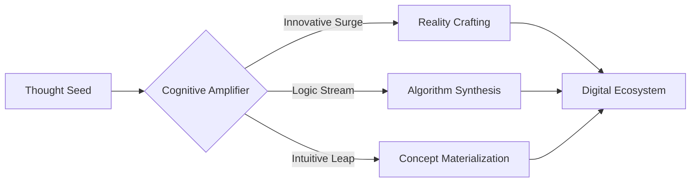

# Sainath M. Belagavi | Digital Frontier Explorer

<div align="center">


[](https://linkedin.com/in/Sainath-Belagavi)
[](https://github.com/saibelagavi)
[](mailto:belagavisainath1@gmail.com)

</div>

## 🧠 Cognitive Interface



## 🌌 Capability Nexus

| Dimension | Mastery |
|:---------:|---------|
| 🌐 Interface Weaving | `React Cortex` `NextJS Synapse` `TailwindCSS Flux` `Bootstrap Neuron` |
| 🧠 Logic Core | `BioC` `Quantum++` `NeuroJava` `PsiPHP` `PythonX` `NodeJS Nexus` |
| 🗃️ Data Fabric | `HoloSQL` `MongoMind` |
| 🤖 Artificial Cognition | `Machine Learning Fusion` `Language Model Architecture` `Neural Network Genesis` |

## 🚀 Reality Constructs

<table>
<tr>
<td align="center">

<br />
<sub><b>NeuroDrive</b></sub>
</td>
<td align="center">

<br />
<sub><b>TimeWarp</b></sub>
</td>
<td align="center">

<br />
<sub><b>NeuroRehab</b></sub>
</td>
</tr>
</table>

## 🌟 Achievement Matrix

- 🏆 Pioneered advanced embedded wheel electric motor, clinching ideathon victories
- 🚀 Engineered time-bending application for electric and CNG vehicle efficiency
- 🧠 Crafted IoT-based rehabilitation device for neural reactivation, revolutionizing accessibility
- 🎵 Dual national harmonic resonance champion

## 💾 Experience Continuum

- **Eyesec Cyber Security Solutions Pvt. Ltd.** | AI ML Nexus Explorer _(08/2023 - 09/2023)_
- **Suvidha Mahila Mandal** | Machine Learning Architect _(09/2023 - 10/2023)_
- **KHECHARI-TECHNOLOGIES Pvt Ltd** | Web Development Innovator _(11/2019 - 12/2019)_
- **Hamari Pahchan NGO** | Social Matrix Engineer _(08/2023 - 09/2023)_

## 🌈 Thought Stream

```python
class SainathBelagavi:
    def __init__(self):
        self.focus = ["Generative AI", "Language Model Architecture", "Neural Interfaces"]
        self.mission = "Forge digital realities that amplify human potential"

    def explore(self):
        while True:
            self.learn()
            self.innovate()
            self.collaborate()
            yield self.expand_possibilities()

explorer = SainathBelagavi()
future = explorer.explore()
next(future)  # Activate the next phase of digital evolution
```

<div align="center">

---

🌌 Venturing Beyond the Digital Horizon 🌌

</div>
