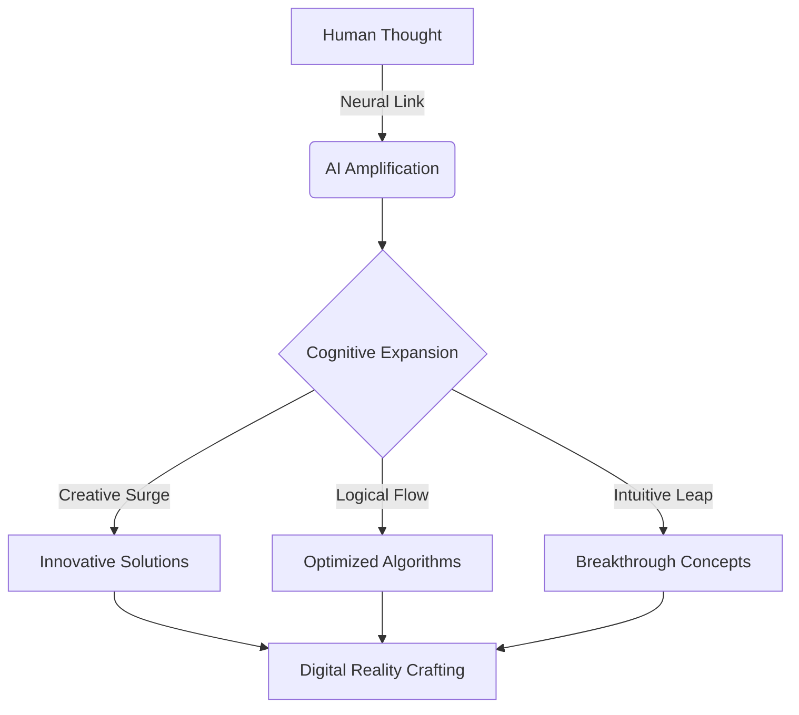

# 🌟 Sainath M. Belagavi: Architect of Digital Frontiers

[](https://linkedin.com/in/Sainath-Belagavi)
[](https://github.com/saibelagavi)
[](mailto:belagavisainath1@gmail.com)

## 🧠 Neural Interface



## 🚀 Quantum Skill Matrix

| Dimension | Technologies |
|-----------|--------------|
| 🌐 HyperFrontend | React Neuron, NextJS Quantum, TailwindCSS Flux |
| 🧠 NeuroBackend | BioC++, QuantumJava, PsiPHP, PythonX, NodeJS Cortex |
| 🗃️ DataSphere | HoloSQL, NebulaDB |
| 🤖 AI Nexus | Machine Learning Fusion, LLM Architecture, Neural Network Synthesis |

## 🌈 Holographic Projects

<table>
  <tr>
    <td align="center">
      
      <br />
      <sub><b>NeuroDrive</b></sub>
    </td>
    <td align="center">
      
      <br />
      <sub><b>TimeWarp</b></sub>
    </td>
    <td align="center">
      
      <br />
      <sub><b>NeuroRehab</b></sub>
    </td>
  </tr>
</table>

## 🌠 Cosmic Achievements

- 🏆 Pioneer of Quantum Embedded Systems
- 🚀 Architect of Temporal Management for EV and CNG Propulsion
- 🧠 Creator of Sub-500₹ NeuroRehabilitation Devices
- 🎵 Dual National Harmonic Resonance Champion

## 💾 Experience Continuum

- **Eyesec Cyber Security Solutions Pvt. Ltd.** | AI ML Nexus (08/2023 - 09/2023)
- **Suvidha Mahila Mandal** | Machine Learning Architect (09/2023 - 10/2023)
- **KHECHARI-TECHNOLOGIES Pvt Ltd** | HoloWeb Developer (11/2019 - 12/2019)
- **Hamari Pahchan NGO** | Social Matrix Engineer (08/2023 - 09/2023)

## 🌌 Thought Stream

```javascript
const sainath = {
  focus: ["Generative AI", "Large Language Models", "Neural Interfaces"],
  passion: "Pushing the boundaries of human-AI symbiosis",
  mission: "To craft digital realities that enhance human potential"
};

while (true) {
  sainath.learn();
  sainath.innovate();
  sainath.collaborate();
  universe.expand();
}
```

---

<div align="center">

📡 Quantum Entangled Since 2023 | Projecting into 2030 and Beyond

</div>
